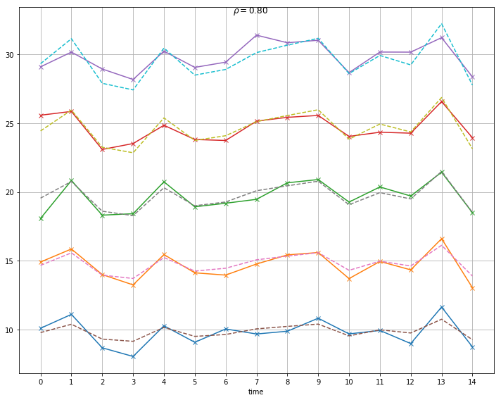
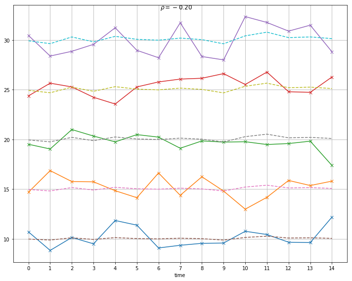
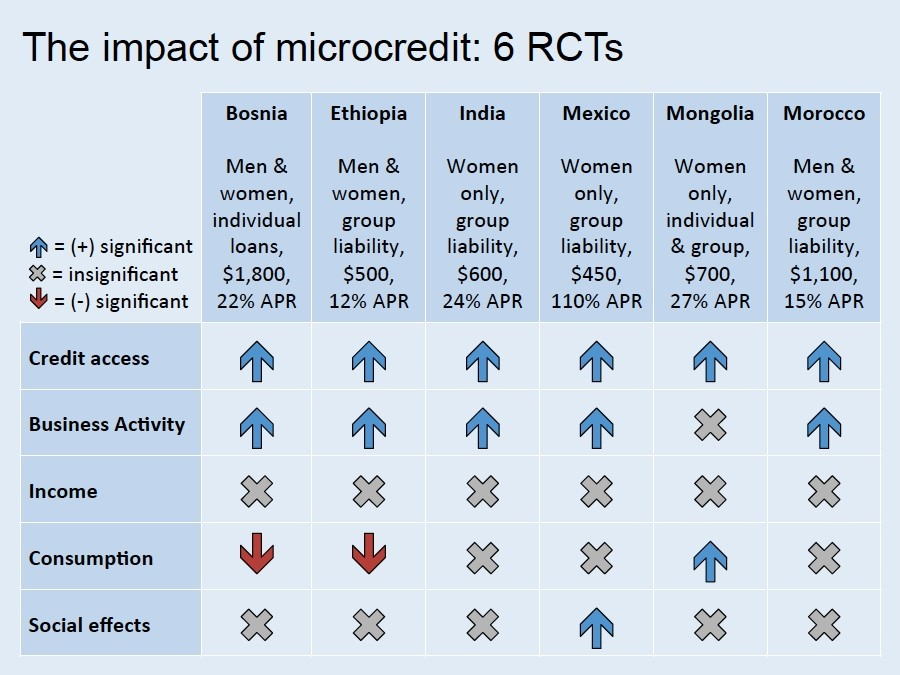

# Risk Sharing

### The Planner's Problem

$$
\max_{c_{it}(s^t)} \sum_{i} \lambda_i \sum_{t=1}^{\infty}\sum_{s^t} \delta^t \pi(s^t)u_i(c_{it}(s^t))
$$

$\lambda_{i}$ are Pareto weights of household $i$ in the social planners objective

$\pi(s^t)$ is the probability of history $s^t$ occurring 
$$
\sum\limits_i {c_{it} (s^t)} \le \sum\limits_i {y_{it} (s_t),} \,\,\,\,\,\forall s^t,\forall t,
$$

------

### Efficient allocation

Simplify to a single period. For any two individuals  $i, \upsilon$:
$$
{\lambda_\upsilon \cdot u^{\prime}_\upsilon (c_{\upsilon s} )}={\lambda_i \cdot u^{\prime}_i (c_{is})},\,\,\,\,\forall s
$$
Weighted marginal utilities of consumption equalized across individuals in every state. 

------

#### Example:

Utility of CRRA form $u(c_{is})=ln(c_{is})$ 

Stochastic income: $y_{is}= \bar y_i +\mu_{is}$    with  $\mu_{is} \sim \mathcal{N}(0,\Sigma)$

Suppose also Pareto weights proportional to person's share of expected income:  $\lambda_i =\frac{\bar y_i}{\bar Y}$  where $\bar Y = \sum \bar y_j$

Efficient consumption smoothing completely insures individual against idiosyncratic shocks, but not aggregate shocks.  

$c_{is}=\lambda_i \cdot  Y_s$  

------

#### Example (continued)

Efficient consumption smoothing test: own consumption should depend on aggregate village income, not idiosyncratic income.  Same result holds for other utility functions.

FE regression of consumption on own and

$c_{is}=\beta_0 + \beta_1 y_{is} + \beta_2  \cdot  Y_s + e_{i} + \epsilon_{is}$  

Under consumption smoothing expect $\beta_1=0$ and $\beta_2 >0$

---

### Simulated income and smoothed consumption
See [village sharing](http://nbviewer.jupyter.org/github/jhconning/Dev-II/blob/master/notebooks/Village_sharing.ipynb) jupyter notebook. 

Sample village economy with five households with different levels of expected base income and idiosyncratic shocks.

$$y_{is}= \bar y_i +\mu_{is} $$    
with  $\mu_{is} \sim \mathcal{N}(0,\Sigma)$

Consumption sharing rule for log utility and pareto weights proportional to household expected income. 

---

#### Independent shocks

---

---

#### Positively correlated shocks

---

#### Negatively correlated shocks

---

## Microfinance Impact

#### Identification Challenges
- Endogenous program placement
- beneficiary self-selection
- heterogenous effects

#### Early Impact Evaluations
- Observational, natural discontinuities

---

Pitt, Mark M., and Shahidur R. Khandker. 1998. “The Impact of Group-Based Credit Programs on Poor Households in Bangladesh: Does the Gender of Participants Matter?” *Journal of Political Economy* 106 (5): 958–996.

- Borrowers must not own more than threshold level of land
- Basis for a discontinuity design

---

Roodman, David, and Jonathan Morduch. 2014. “The Impact of Microcredit on the Poor in Bangladesh: Revisiting the Evidence.” *Journal of Development Studies* 50 (4): 583–604.

>We replicate and reanalyse the most influential study of microcredit impacts.... That study was celebrated for showing that microcredit reduces poverty, a much hoped for possibility (though one not confirmed by recent randomised controlled trials). We show that the original results on poverty reduction disappear after dropping outliers, or when using a robust linear estimator. Using a new program for estimation of mixed process maximum likelihood models, we show how assumptions critical for the original analysis, such as error normality, are contradicted by the data. We conclude that questions about impact cannot be answered in these data.

---

### Microfinance Impact Evaluation with RCTs

Six studies published in [special issue](https://www.aeaweb.org/issues/360) of AEJ: Applied Economics in the 2015 

---

[source](https://www.cgdev.org/blog/final-word-microcredit)
---

---

